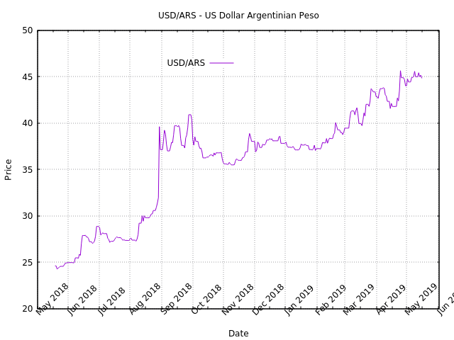

# dolar-rs

This was originally an attempt to port to Rust language the USD/ARS predictor from https://github.com/acrosa/dolar. It changed to a last-year USD/ARS evolution chart generator.
In order to run it, you should install [gnuplot](http://www.gnuplot.info/).

